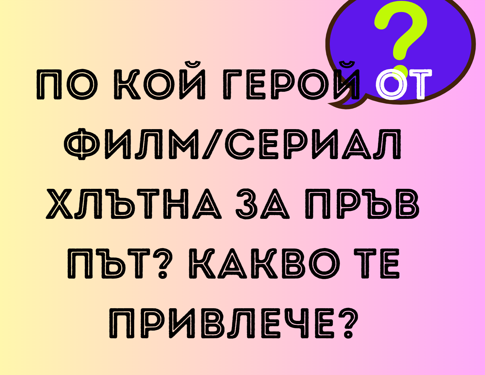
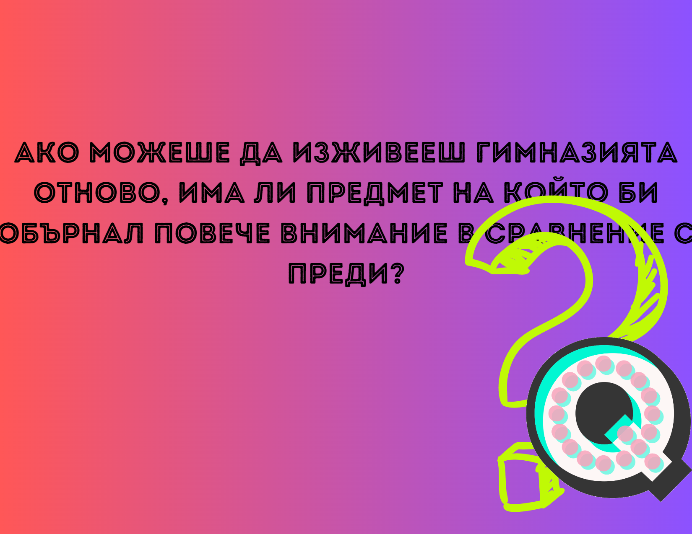

# Image-Carousel-18JS
 https://www.youtube.com/watch?v=-5yNF2J0Coc&list=PLtMugc7g4GaqAVDZwQ_t1H6500ZGJzOgW&index=6

# [Preview](https://hiratsuna.github.io/Image-Carousel-18JS/)

## html
- [font awesome](https://cdnjs.com/libraries/font-awesome)

## css
- [link](https://cdnjs.cloudflare.com/ajax/libs/font-awesome/6.4.0/css/all.min.css) `https://cdnjs.cloudflare.com/ajax/libs/font-awesome/6.4.0/css/all.min.css`

## js

----
`<!DOCTYPE html>
<html lang="en">
<head>
    <meta charset="UTF-8">
    <meta name="viewport" content="width=device-width, initial-scale=1.0">
    <link rel="stylesheet" href="https://cdnjs.cloudflare.com/ajax/libs/font-awesome/6.4.0/css/all.min.css">
    <title>Image Carousel #6</title>
    
    <!-- Inline CSS styles -->
    
</head>
<body>

<!-- A container to hold the image carousel -->

    <!-- Image elements representing the carousel slides -->
    

        
    

    

        
    

    

        <
    

        
    

    

        
    

    

        
    

    

        
    

    

        
    

    

        
    

    <!-- Navigation arrows for moving to the previous and next images -->
    <i id="prev" onclick="show_image(-1)" class="fa-solid fa-circle-chevron-left"></i>
    <i id="next" onclick="show_image(1)" class="fa-solid fa-circle-chevron-right"></i>

    <!-- Dots for indicating the currently displayed image -->
    

        
        
        
        
        
        
        
        
    

<!-- JavaScript code for image carousel functionality -->

</body>
</html>`
